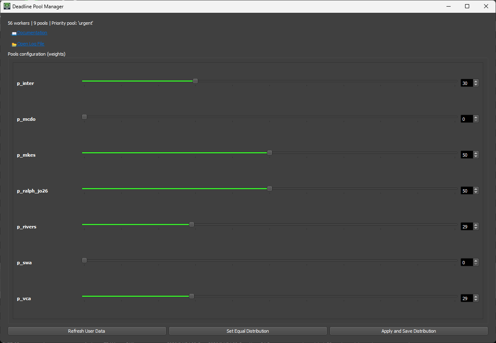

# Deadline Pool Manager

 

The Deadline Pool Manager scripts ensures that each pool gets an even distribution of powerful and less powerful machines, proportional to its needs. The system distributes machines by alternating between high-performance and low-performance workers and rotating across pools, giving more turns to pools with higher weights. The weight is calculated using the following formula:

```python
# Hardware score formula
SCORE** = RAM_GB * 0.5 + CPU_CORES + VRAM_GB * 2
```

All machines in the farm belong to all pools, which correspond to the current productions at our studio. Jobs are distributed across the farm based on their pool, priority, and submission time. The order in which pools are assigned to a given machine affects job selection: when multiple jobs with the same priority arrive simultaneously for a CASTOR machine configured with the pools urgent, poolA, and poolB, Deadline processes jobs in the order urgent, then poolA, and finally poolB. While this behavior functions as designed, modifying the pool order for workers in the Deadline interface is not straightforward, as it requires selecting a pool, selecting one or more workers, and using the Promote or Demote actions to adjust their order.

## User Interface

On the Pool Manager window, you can use sliders to assign different weights to each pool. These weights determine how many workers are allocated to each pool. For example, a pool with a weight of 20 will receive twice as many workers as a pool with a weight of 10. Therefore, if there are 20 workers in total, the first pool will receive approximately 15 workers and the second 5.

When the window opens, it loads the current weighted pool configuration. You can refresh the slider values by clicking “**Refresh User Data**”. You can also set all sliders to 50 by clicking “**Set Equal Distribution**”. Finally, clicking “**Apply and Save Distribution**” updates the worker pool selection with the selected slider distribution, and saves this configuration to a JSON file for automatic pool updates.

## Discord Webhook

The **“PoolManagerWebhook.py”** script sends or updates a Discord webhook message with the current pool distribution rates for productions, as defined in a configuration JSON file. It reads the pool distribution data, and formats it into a Discord embed with color-coded bars and emojis based on percentage values. The script keeps track of the last sent message ID to edit the message instead of sending a new one each time. The script is intended to be run using the windows task scheduler with the **“run_pool_webhook.bat”** file.